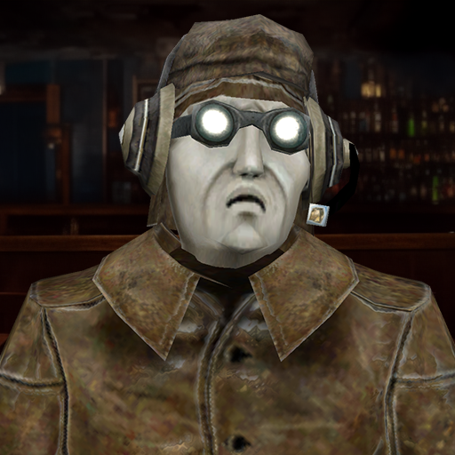

# PavlikRPG's Discord Bot


<p align="center">
    <br>
    <a href="https://discord.gg/sPrGBP9aFd">
        
    </a>&emsp;
    <a href="https://www.youtube.com/@pavlikrpg">
        
    </a><br><br>
    <a href="https://github.com/zatinu322/Var-Mod-Trash-Machina/releases/tag/v1.2-beta">
        
    </a><br/>
    
</p>

Бот для моего дискорд сервера.

Написан на Python 3.13, построен на библиотеке `discord.py`.

### Запуск

В корне репозитория создайте `.env` с нужными переменными,
с примером можно ознакомиться в [.env.example](./.env.example).

После соберите образ:
```sh
docker compose build
```

И запустите:
```
docker compose up
```

***

- [CONTRIBUTING.md](./CONTRIBUTING.md) - инструкцию по запуску локальной инсталляции.
- [CHANGELOG](./CHANGELOG) - список изменений.
